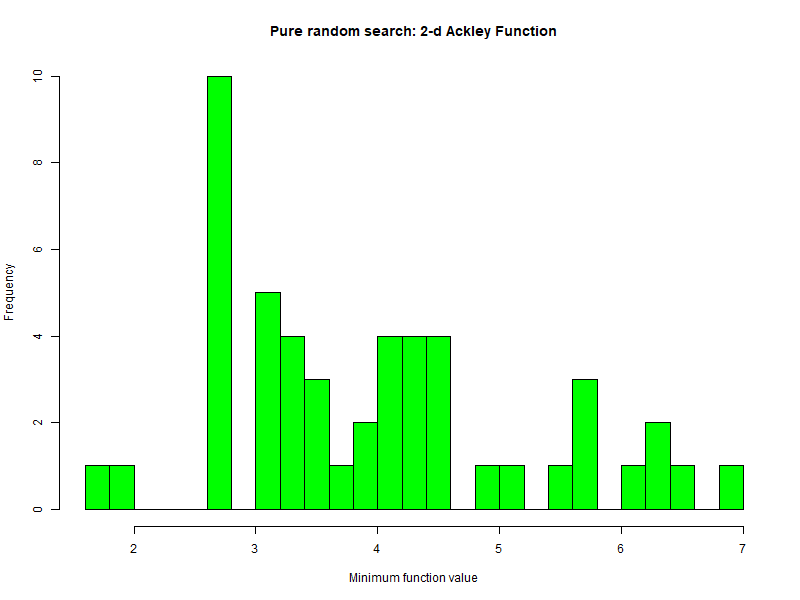
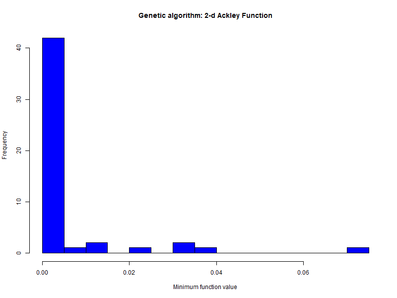
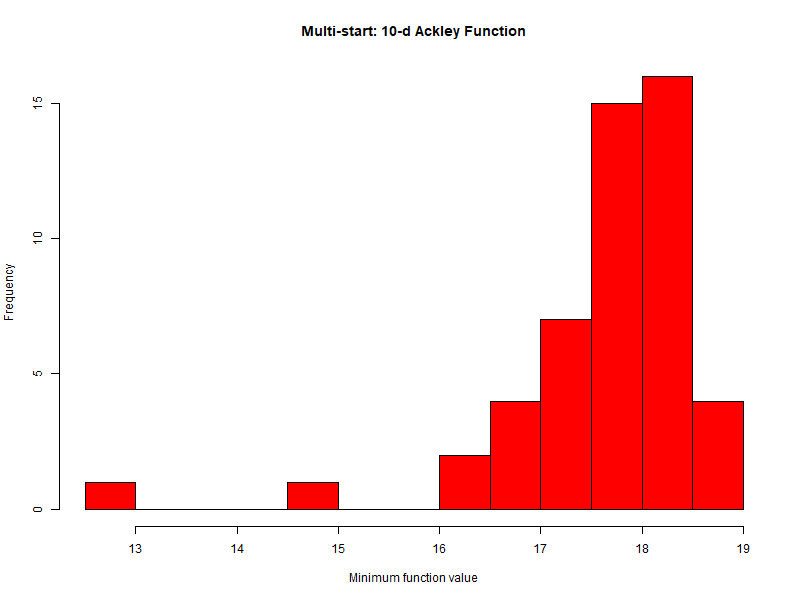
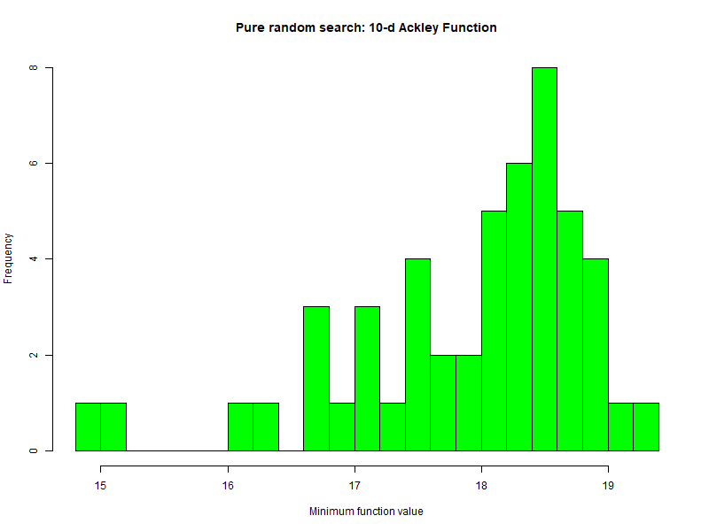
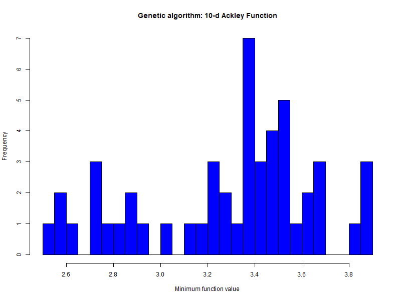
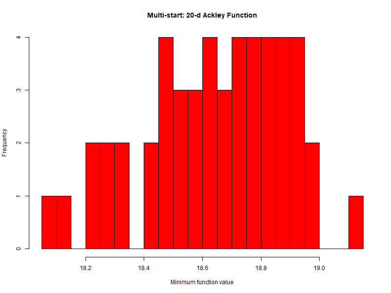
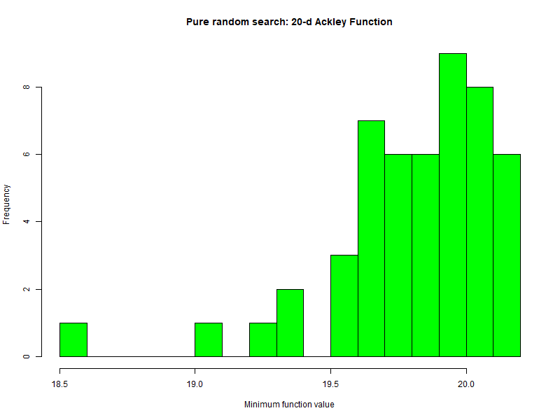
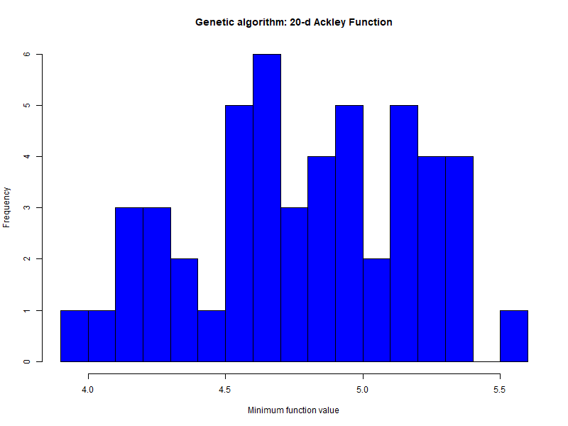

# Wstęp

## Omówienie algorytmów

### Poszukiwanie przypadkowe (Pure Random Search - PRS)

Algorytm polega na losowaniu punktów z kostki z rozkładu jednostajnego. Po kolei losuję punkty dla każdej współrzędnej z wymiaru dziedziny analizowanej funkcji. Następnie obliczam wartość funkcji w wylosowanym punkcie i sprawdzam czy jest ona mniejsza od dotychczasowego minimum. Jeśli tak, to zapisuję nowe minimum. Do losowania punktów użyłem funkcji `runif` - dostępnej w środowisku R.

### Metoda wielokrotnego startu (Multi-Start - MS)

Algorytm polega na wielokrotnym uruchamianiu algorytmu optymalizacji z różnych punktów startowych. W naszym przypadku skorzystałem z funkcji `optim` ze środowiska R ustawiając ją aby korzystała z algorytmu `L-BFGS-B`. Punkty startowe losuję tak jak poprzednio za pomocą funkcji `runif`.

### Algorytm Genetyczny (GA)

Do przetestowania tego algorytmu użyłem implementacji z pakietu `ecr` . Do mutowania populacji używałem algorytmu mutowania Gaussa, z odchyleniem standardowym $\sigma = 1.5$. Jako startową liczbę populacji wybrałem `100`, a wzrost jako `5`.

## Warunki porównania

Aby porównanie było sprawiedliwe, budżet wywołań funkcji ustawiałem na podstawie ilości wywołań funkcji testowanej w algorytmie MS. Uruchamiałem algorytm `100` razy szukając minimalnej wartości funkcji, jednocześnie sumując liczbę wywołań funkcji przez funkcję `optim`.

Wynik każdego z algorytmów uśredniałem, wykonując `50` powtórzeń algorytmu. Zbiór wartości minimalnych wytworzony w ten sposób stanowił następnie podstawę do analizy istotności wyników, sporządzenia wykresów oraz porównania wyników algorytmów.

## Testowane funkcje

Jako testowane funkcje wybrałem funkcje z pakietu `smoof`: Ackley'a oraz Rosenbrock'a Funkcje te są funkcjami wielowymiarowymi, co pozwala na przetestowanie algorytmów dla różnych wymiarów dziedziny funkcji. Wybrane do testów wymiary funkcji to `2, 10, 20`.

# Wyniki

Do prezentacji wyników wybrałem wykresy skrzypcowe. Wykresy te pozwalają na łatwe porównanie rozkładów wartości minimalnych funkcji dla każdego z algorytmów. Pod wykresami zawarłem opisy z uzyskanymi wartościami średnimi.

## Funkcja Ackley'a

### Funkcja Ackley'a 2D

Budżet określony przez funkcję MS wyniósł `1380` wywołań funkcji.

{width="800"}





|                                                           |                                                                  |                                                                 |
|-----------------------|-------------------------|-------------------------|
|  |  |  |
| $\mu$ = 1.5934                                            | $\mu$ = 3.9976                                                   | $\mu$ = 0.0051                                                  |


Analizując wykresy, zauważamy, że zarówno metoda wielokrotnego startu, jak i algorytm genetyczny, wykazują wyniki, które są bardziej zbliżone do zera, a mediana jest utrzymana na poziomie 0. W porównaniu do dwóch pozostałych metod, algorytm genetyczny wyróżnia się tym, że wyniki są skoncentrowane w wąskim obszarze, co sugeruje pewną stabilność i spójność osiąganych rezultatów.

Natomiast metoda wielokrotnego startu również prezentuje zbliżone wyniki do zera, ale ich rozproszenie może być bardziej zróżnicowane, co może oznaczać większą różnorodność w rezultatach tej metody. Warto zwrócić uwagę, że obie metody wykazują podobne położenie mediany na poziomie 0.

Rozpatrując metody pod kątem położenia i rozproszenia wyników, możemy również zauważyć, że metoda poszukiwania przypadkowego prezentuje najbardziej równomierne rozłożenie wyników. Tutaj wyniki są bardziej rozproszone, co może wskazywać na większą losowość i różnorodność w rezultatach tej metody, w przeciwieństwie do bardziej skondensowanych wyników algorytmu genetycznego.

### Funkcja Ackley'a 10D

Budżet określony przez funkcję MS wyniósł `1453` wywołań funkcji.







|                                                            |                                                                   |                                                                  |
|-----------------------|-------------------------|-------------------------|
|  |  |  |
| $\mu$ = 17.8595                                            | $\mu$ = 18.0632                                                   | $\mu$ = 3.14070                                                  |


Analizując wykres, zwraca uwagę, że obszar wyników metody wielokrotnego startu i metody poszukiwania przypadkowego jest częściowo wspólny, jednak ten pierwszy wykazuje większą koncentrację, co sugeruje pewną stabilność w rezultatach. Obydwie metody mają również medianę utrzymaną na tym samym poziomie, co podkreśla podobieństwo średnich wyników.

Natomiast algorytm genetyczny wyróżnia się znacznie odmiennym położeniem i rozmiarem obszaru wyników. Jego skondensowany obszar oznacza, że rezultaty są bardziej jednorodne, a osiągane wartości są istotnie mniejsze niż w przypadku pozostałych metod.

Dodatkowo, zauważamy, że metoda poszukiwania przypadkowego prezentuje się jako bardziej losowe podejście, charakteryzując się równomiernym rozkładem wyników na wykresie. To może sugerować większą różnorodność w rezultatach, co kontrastuje z bardziej skoncentrowanymi wynikami metody wielokrotnego startu.

### Funkcja Ackley'a 20D

Budżet określony przez funkcję MS wyniósł `1425` wywołań funkcji.







|                                                            |                                                                   |                                                                  |
|-----------------------|-------------------------|-------------------------|
|  |  |  |
| $\mu$ = 18.7025                                            | $\mu$ = 19.8260                                                   | $\mu$ = 4.93818                                                  |


\
Obserwując wykres, zauważamy, że algorytm genetyczny wyróżnia się najszerszym obszarem wyników jak i najbardziej równomiernym ich rozkładem. Co istotne, osiągane przez ten algorytm wartości są istotnie mniejsze w porównaniu do pozostałych dwóch metod. To nadaje mu unikalny charakter i sugeruje, że rezultaty są bardziej zróżnicowane, a jednocześnie utrzymują niższe wartości.

W przypadku metody wielokrotnego startu i metody przeszukiwania, zauważamy pewne pokrywanie się obszarów wyników, choć nie jest to zbyt znaczące. Obydwie metody prezentują rozkład wartości stosunkowo równomierny, jednak ich wyniki są nieco przesunięte w stronę górnej granicy obszaru.

## Funkcja Michalewicza

### Funkcja Michalewicza 2D

Budżet określony przez funkcję MS wyniósł `1213` wywołań funkcji.

.png)

.png)

.png)

|                                                                               |                                                                                      |                                                                                     |
|-----------------------|-------------------------|-------------------------|
| .png) | .png) | .png) |
| $\mu$ = -1.8013                                                               | $\mu$ = -1.7357                                                                      | $\mu$ = -1.8011                                                                     |

.png)

Analizując wykres, uwydatniają się znaczące różnice między algorytmem poszukiwania przypadkowego a pozostałymi dwoma metodami. Obszar wyników dla metody przypadkowej jest znacznie szerszy, a osiągane wartości są wyraźnie większe. Jednakże, rozkład tych wyników koncentruje się głównie wokół dolnej granicy obszaru.

W przypadku algorytmu genetycznego zauważamy bardzo wąski wykres, gdzie praktycznie wszystkie wartości są skondensowane w jednym miejscu, z wyjątkiem kilku punktów odstających od reszty. To świadczy o wyraźnej koncentracji wyników w pewnym obszarze, co może sugerować wysoką spójność rezultatów, choć istnieją punkty wyjątkowe.

Natomiast algorytm wielokrotnego startu wyróżnia się najwęższym obszarem wyników i najbardziej równomiernym ich rozkładem. To sugeruje, że rezultaty tej metody są stabilne i jednocześnie charakteryzują się pewnym stopniem równomierności.

### Funkcja Michalewicza 10D

Budżet określony przez funkcję MS wyniósł `4849` wywołań funkcji.

.png)

.png)

.png)

|                                                                                |                                                                                       |                                                                                      |
|-----------------------|-------------------------|-------------------------|
| .png) | .png) | .png) |
| $\mu$ = -7.0677                                                                | $\mu$ = -4.4816                                                                       | $\mu$ = -5.0698                                                                      |

.png)

Analizując wykres, zwraca uwagę, że algorytm genetyczny prezentuje najszerszy obszar wyników, który w większości pokrywa się z obszarami pozostałych metod. Niemniej jednak, większość tych wyników jest skoncentrowana w jednym miejscu, z pojedynczymi punktami odbiegającymi od głównej masy rezultatów.

Podobny charakter równomiernego rozkładu w wąskim obszarze obserwujemy również w przypadku algorytmu poszukiwania przypadkowego. Choć jego wyniki są równomiernie rozłożone, to jednak istnieją pojedyncze wartości, które odbiegają od reszty, co dodaje pewnej dynamiki i różnorodności w rezultatach.

W odróżnieniu od powyższych, metoda wielokrotnego startu wyróżnia się rezultatami znacznie mniejszymi, bardziej rozproszonymi po całym obszarze. To sugeruje, że choć rezultaty tej metody są zróżnicowane, to jednak osiągane wartości są istotnie mniejsze, co nadaje jej unikalny charakter w porównaniu do pozostałych podejść.

### Funkcja Michalewicza 20D

Budżet określony przez funkcję MS wyniósł `6498` wywołań funkcji.

.png)

.png)

.png)

|                                                                                |                                                                                       |                                                                                      |
|-----------------------|-------------------------|-------------------------|
| .png) | .png) | .png) |
| $\mu$ = -11.1719                                                               | $\mu$ = -6.8647                                                                       | $\mu$ = -7.3865                                                                      |

.png)

Przy analizie wykresu zauważamy, że obszar wyników algorytmu genetycznego jest najbardziej rozległy, pokrywając się w dużej mierze z rezultatami innych metod. Niemniej jednak, większość tych wyników jest skupiona w jednym obszarze, jedynie z pojedynczymi odstępstwami, co nadaje temu algorytmowi charakterystyczny charakter.

W przypadku algorytmu poszukiwania przypadkowego obserwujemy równomierny rozkład wyników w wąskim obszarze, jednak warto zaznaczyć, że te rezultaty są bardziej skoncentrowane w okolicy górnej granicy obszaru. Pojedyncze wartości odbiegają od reszty, wprowadzając pewne zróżnicowanie i dynamikę w rezultatach.

W odniesieniu do metody wielokrotnego startu, rezultaty są istotnie mniejsze i bardziej rozproszone po całym obszarze. To podkreśla, że choć wyniki tej metody są zróżnicowane, to ich wartości są niższe.

# Porównanie istotności wyników

Zdecydowaliśmy się na wykonanie porównań istotności wyników jako porównanie wyników każdego algorytmu z każdym w dla każdej funkcji z każdym wymiarem. Użyliśmy funkcji `t.test(wyniki1, wyniki2)`. Wybraliśmy
test $T$ studenta dlatego, że nie znamy wariancji populacji. Testy wykonywaliśmy na poziomie istotności
$1 - \alpha = 0.95$. Sprawdzaliśmy czy algorytmy dają istotnie różne/takie same wyniki.\\
Jako hipotezy przyjęliśmy:
\[ H_0: \mu_1 = \mu_2 \]
\[ H_1: \mu_1 \neq \mu_2\]

## Funkcja Ackley'a 2D
### Porównanie MS-PRS
Wynik wywołania procedury `t.test`:
```
Welch Two Sample t-test

data:  results$data$ms and results$data$prs
t = -7.2819, df = 74.264, p-value = 2.872e-10
alternative hypothesis: true difference in means is not equal to 0
95 percent confidence interval:
 -3.292511 -1.877831
sample estimates:
mean of x mean of y 
 1.378329  3.963500 
```

Analizując wynik testu, możemy stwierdzić, że wyniki algorytmów MS i PRS są istotnie różne. Na $95%$ poziomie istotności możemy stwierdzić, że różnica średnich wyników jest z przedziału $(-3.293, -1.878)$.

### Porównanie MS-GA
Wynik wywołania procedury `t.test`:
```
Welch Two Sample t-test

data:  results$data$ms and results$data$ga
t = 131.71, df = 85.626, p-value < 2.2e-16
alternative hypothesis: true difference in means is not equal to 0
95 percent confidence interval:
 14.13444 14.56768
sample estimates:
mean of x mean of y 
17.802609  3.451551 
```
### Porównanie PRS-GA
Wynik wywołania procedury `t.test`:
```
Welch Two Sample t-test

data:  results$data$prs and results$data$ga
t = 113.46, df = 74.59, p-value < 2.2e-16
alternative hypothesis: true difference in means is not equal to 0
95 percent confidence interval:
 14.41950 14.93494
sample estimates:
mean of x mean of y 
18.128770  3.451551 
```