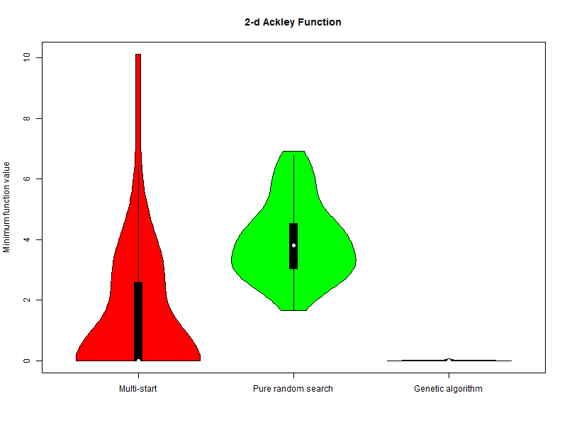
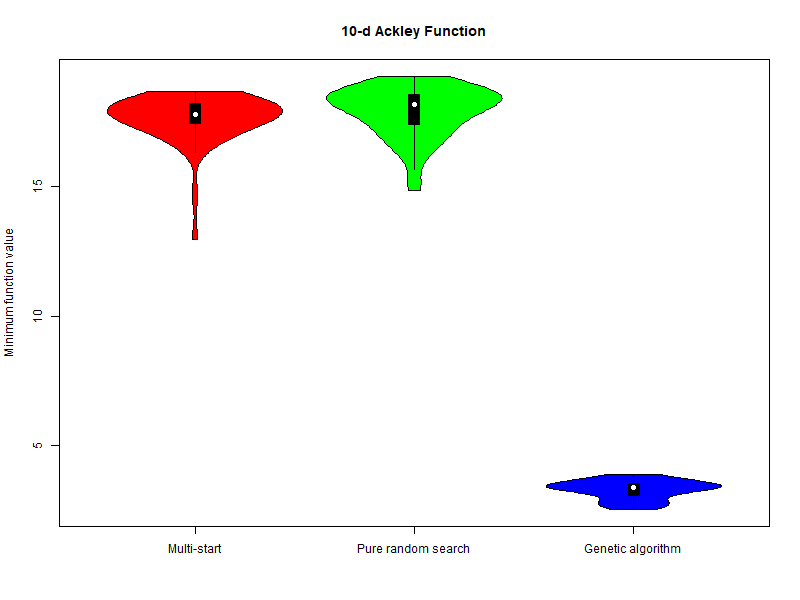

# Wstęp

## Omówienie algorytmów

### Poszukiwanie przypadkowe (Pure Random Search - PRS)

Algorytm polega na losowaniu punktów z kostki z rozkładu jednostajnego. Po kolei losuję punkty dla każdej współrzędnej z wymiaru dziedziny analizowanej funkcji. Następnie obliczam wartość funkcji w wylosowanym punkcie i sprawdzam czy jest ona mniejsza od dotychczasowego minimum. Jeśli tak, to zapisuję nowe minimum. Do losowania punktów użyłem funkcji `runif` - dostępnej w środowisku R.

### Metoda wielokrotnego startu (Multi-Start - MS)

Algorytm polega na wielokrotnym uruchamianiu algorytmu optymalizacji z różnych punktów startowych. W naszym przypadku skorzystałem z funkcji `optim` ze środowiska R ustawiając ją aby korzystała z algorytmu `L-BFGS-B`. Punkty startowe losuję tak jak poprzednio za pomocą funkcji `runif`.

### Algorytm Genetyczny (GA)

Do przetestowania tego algorytmu użyłem implementacji z pakietu `ecr` . Do mutowania populacji używałem algorytmu mutowania Gaussa, z odchyleniem standardowym $\sigma = 1.5$. Jako startową liczbę populacji wybrałem `100`, a wzrost jako `5`.

## Warunki porównania

Aby porównanie było sprawiedliwe, budżet wywołań funkcji ustawiałem na podstawie ilości wywołań funkcji testowanej w algorytmie MS. Uruchamiałem algorytm `100` razy szukając minimalnej wartości funkcji, jednocześnie sumując liczbę wywołań funkcji przez funkcję `optim`.

Wynik każdego z algorytmów uśredniałem, wykonując `50` powtórzeń algorytmu. Zbiór wartości minimalnych wytworzony w ten sposób stanowił następnie podstawę do analizy istotności wyników, sporządzenia wykresów oraz porównania wyników algorytmów.

## Testowane funkcje
Jako testowane funkcje wybrałem funkcje z pakietu `smoof`: Ackley'a oraz Rosenbrock'a Funkcje te są funkcjami wielowymiarowymi, co pozwala na przetestowanie algorytmów dla różnych wymiarów dziedziny funkcji. Wybrane do testów
wymiary funkcji to `2, 10, 20`.

# Wyniki

Do prezentacji wyników wybrałem wykresy skrzypcowe. Wykresy te pozwalają na łatwe porównanie rozkładów wartości minimalnych funkcji dla każdego z algorytmów. Pod wykresami zawarłem opisy z uzyskanymi wartościami średnimi.

## Funkcja Ackley'a

### Funkcja Ackley'a 2D

Budżet określony przez funkcję MS wyniósł `1380` wywołań funkcji.  

<table>
<tr>
  <td>  </td>
  <td>  </td>
  <td>  </td>
</tr>
<tr>
  <td> 
 $\mu = 1.5934$ 
 </td> 
  <td> 
 $\mu = 3.9976$ 
 </td> 
  <td> 
 $\mu = 0.0051$ 
 </td> 
</tr>
</table>

### Funkcja Ackley'a 10D

Budżet określony przez funkcję MS wyniósł `1453` wywołań funkcji.  

<table>
<tr>
  <td>  </td>
  <td>  </td>
  <td>  </td>
</tr>
<tr>
  <td> 
 $\mu = 17.8595$ 
 </td> 
  <td> 
 $\mu = 18.0632$ 
 </td> 
  <td> 
 $\mu = 3.14070$ 
 </td> 
</tr>
</table>

### Funkcja Ackley'a 20D

Budżet określony przez funkcję MS wyniósł `1425` wywołań funkcji.  

<table>
<tr>
  <td>  </td>
  <td>  </td>
  <td>  </td>
</tr>
<tr>
  <td> 
 $\mu = 18.7025$ 
 </td> 
  <td> 
 $\mu = 19.8260$ 
 </td> 
  <td> 
 $\mu = 4.93818$ 
 </td> 
</tr>
</table>

## Funkcja Michalewicza

### Funkcja Michalewicza 2D
Budżet określony przez funkcję MS wyniósł `1213` wywołań funkcji.  

<table>
<tr>
  <td>  </td>
  <td>  </td>
  <td>  </td>
</tr>
<tr>
  <td> 
 $\mu = -1.8013$ 
 </td> 
  <td> 
 $\mu = -1.7357$ 
 </td> 
  <td> 
 $\mu = -1.8011$ 
 </td> 
</tr>
</table>

.png)

### Funkcja Michalewicza 10D
Budżet określony przez funkcję MS wyniósł `4849` wywołań funkcji.  

<table>
<tr>
  <td>  </td>
  <td>  </td>
  <td>  </td>
</tr>
<tr>
  <td> 
 $\mu = -7.0677$ 
 </td> 
  <td> 
 $\mu = -4.4816$ 
 </td> 
  <td> 
 $\mu = -5.0698$ 
 </td> 
</tr>
</table>

.png)

### Funkcja Michalewicza 20D
Budżet określony przez funkcję MS wyniósł `6498` wywołań funkcji.  

<table>
<tr>
  <td>  </td>
  <td>  </td>
  <td>  </td>
</tr>
<tr>
  <td> 
 $\mu = -11.1719$ 
 </td> 
  <td> 
 $\mu = -6.8647$ 
 </td> 
  <td> 
 $\mu = -7.3865$ 
 </td> 
</tr>
</table>

.png)
